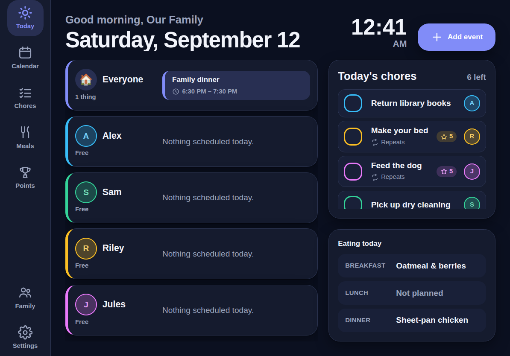

# Family Planner

A wall-mounted family planner for a 10–13" iPad in landscape: the calendar,
chore lists, meal plan and family photos a household actually looks at, sized to
be read from across the kitchen.

Everything is stored on the device. There is no account, no server and no
network call — the planner works with the Wi-Fi off.



## Running it

```bash
npm install
npm run dev      # http://localhost:5173
npm run build    # production build into dist/
npm run preview  # serve the production build
```

### Putting it on the iPad

1. Serve `dist/` from any machine on the home network (`npm run preview -- --host`,
   or copy `dist/` onto a small static host).
2. Open the URL in Safari on the iPad.
3. Share → **Add to Home Screen**.
4. Launch it from the Home Screen. The manifest declares `display: standalone`,
   so it opens full-screen with no Safari chrome — the address bar, tabs and
   toolbar are all gone.

For a permanent wall display, also turn off Auto-Lock in iOS Settings → Display
& Brightness, and use Guided Access (Settings → Accessibility) to keep small
hands inside the app.

## What it does

**Today** — the home screen. One lane per family member plus a shared lane,
showing everything on today's schedule, with today's chores and meals beside it.
Lanes stack vertically so a household of six still fits on one screen.

**Calendar** — month, week and day. Events carry a title, time, location, notes,
any number of assigned members, and an optional repeat. Tap an empty hour to
create an event there; tap an event to edit it. Member chips filter every view.

**Chores** — any number of lists (Chores, Shopping, Errands…), each item
assignable to one person, with an optional repeat and an optional point value.
The checkbox pops, the tick draws itself and a few sparks fly out.

**Meals** — breakfast, lunch and dinner across seven days. A slot takes free
text or links a saved recipe from the recipe box.

**Family** — everyone in the house, each with a colour and an optional photo.
The colour is what ties a person to their events and chores everywhere else.

**Points** — an optional leaderboard for the kids, fed by completed chores.
Turn it off in Settings and it disappears from the nav.

**Screensaver** — after N minutes untouched the display fades into a slideshow
of family photos with the time over it. Any touch brings the planner back.

## Design notes

The whole UI assumes a **touchscreen on a wall**, which rules out a few habits:

- Nothing depends on hover. There is no hover state that reveals an action.
- Every tap target clears 44px, and the base type scale is one notch above a
  phone's, because the display is read from two metres away, not thirty
  centimetres.
- Navigation is a left rail rather than a bottom bar: in landscape the vertical
  space is the scarce one, and the bottom edge is the furthest point from the
  reader's eye.
- Destructive actions take two taps with a changed label, so a passing elbow
  cannot delete the week.
- Theme follows the clock — light during the day, dark in the evening — with
  the switchover hours set in Settings.

## Architecture

```
src/
  data/          types, Dexie schema, repository, reactive hooks, seed
  lib/           dates, recurrence, colours, images, theme/idle/clock hooks
  components/    shared UI (nav, sheet, buttons, avatar, event pill, todo row)
  features/      one folder per view
```

### The data layer

Storage is IndexedDB through [Dexie](https://dexie.org), behind a
`DataRepository` interface (`src/data/repository.ts`). Every write in the app
goes through that interface, and every reactive read goes through the hooks in
`src/data/hooks.ts`. Those two files are the only ones that import Dexie.

Two decisions keep this sync-ready even though v1 never talks to a server:

- **Client-generated UUIDs, not auto-increment keys**, so records created
  offline on two devices can be merged rather than collide.
- **`createdAt` / `updatedAt` on every record**, so a future sync service has
  something to reconcile on.

Adding a backend later (Supabase, a self-hosted API, a CRDT) means writing a
second `DataRepository` implementation, swapping the instance exported from
`src/data/index.ts`, and reimplementing the hooks against the new source of
truth. No view component changes.

### Dates

Wall-clock dates (a meal slot, an all-day event) are stored as `YYYY-MM-DD`
strings so they never shift across a timezone change. Instants are full ISO
datetimes. Nothing in the app calls `toISOString()` to derive a calendar day —
that silently converts to UTC and moves half the household's evenings to the
wrong date.

### Recurrence

Repeating events and chores store an RFC 5545 `RRULE` string. `rrule` evaluates
in UTC, so `src/lib/recurrence.ts` converts local wall-clock times into "fake
UTC" before expansion and back afterwards: dinner every Tuesday at 6pm stays at
6pm across a DST change.

A repeating **event** is one stored row expanded into occurrences at render
time; deleting a single occurrence records an exception date rather than
dropping the series. A repeating **chore** is one row whose due date rolls
forward, so completion history and earned points survive the reset.

## Not in this version

Called out deliberately rather than half-built:

- **Multi-device sync and accounts.** The data layer is shaped for it (see
  above), but nothing syncs today. Settings → Backup exports and restores the
  whole database as JSON, which is how a household moves to a new iPad.
- **Push notifications.** The planner never interrupts; it is a display.
- **Voice assistant integration.**
